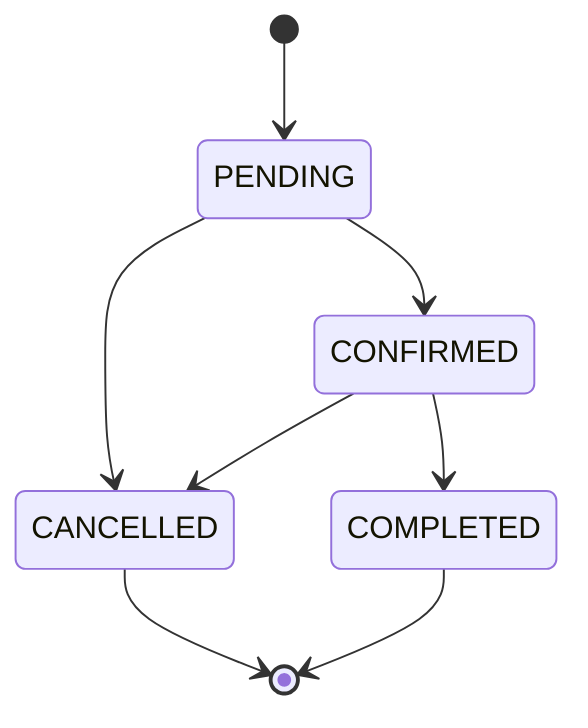

# Appointment domain rules

This document defines the lifecycle and slot-ownership rules enforced by the
appointment API and PostgreSQL database.

## Status lifecycle

| Current status | Allowed next status |
| --- | --- |
| `PENDING` | `CONFIRMED`, `CANCELLED` |
| `CONFIRMED` | `COMPLETED`, `CANCELLED` |
| `CANCELLED` | None; terminal historical record |
| `COMPLETED` | None; terminal historical record |

Patching an appointment to its current status is accepted as an idempotent
no-op. A transition to any other status not shown above returns HTTP 400.

## Completion time

An appointment may become `COMPLETED` only when its scheduled date and time are
less than or equal to the current timezone-aware application time. A future
confirmed appointment cannot be completed.

## Slot ownership and cancellation

An active slot owner is any appointment whose status is not `CANCELLED`,
including `PENDING`, `CONFIRMED`, and `COMPLETED` appointments. PostgreSQL
enforces that only one active row may use a given combination of:

- provider
- appointment date
- appointment time

Cancelling an appointment releases that slot without deleting its historical
row. A new appointment may therefore use the exact provider/date/time while the
cancelled appointment remains queryable.

## Rescheduling

Only `PENDING` and `CONFIRMED` appointments may change provider, date, or time.
The resulting schedule must be in the future. `CANCELLED` and `COMPLETED`
appointments are immutable historical records for these scheduling fields.

## Actor permissions

| Actor | Appointment access |
| --- | --- |
| Patient | Create and read only appointments in the existing patient scope; cannot PATCH |
| Assigned doctor | Read assigned appointments and PATCH only `status` |
| Unrelated doctor | Cannot update the appointment |
| Admin/superuser | May PATCH status and scheduling fields subject to domain rules; may delete |

This phase does not add patient cancellation or broaden doctor permissions.

## Concurrency guarantee

Serializers perform friendly early checks so ordinary conflicts return a clear
validation response. Those checks are not the concurrency authority. The
database constraint `unique_active_provider_appointment_slot` is a conditional
unique constraint applying where status is not `CANCELLED`.

Creates and updates run in short transactions. Updates reload and lock the
current appointment row with `SELECT ... FOR UPDATE` before revalidating and
saving, preventing concurrent changes to one appointment from silently
overwriting each other. When independent creates or reschedules race for one
slot, PostgreSQL selects one winner; the losing integrity error is translated
to HTTP 400 without exposing SQL, constraint names, or internal exceptions.
