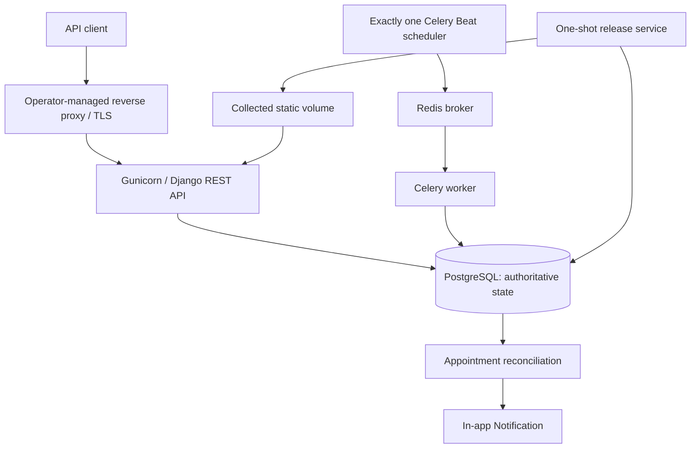

# Architecture

SmartHealthHub is a versioned Django REST API backed by PostgreSQL, with Redis
and Celery providing asynchronous reminder transport. PostgreSQL remains the
authority for users, providers, appointments, notifications, and reminder
eligibility.

## Runtime components

- **Release** waits for healthy PostgreSQL, applies migrations, and collects
  static assets. Runtime services start only after it succeeds.
- **Web** runs Gunicorn as PID 1 and exposes the Django REST API and database
  readiness health endpoint.
- **Worker** consumes reminder work from Redis and reconciles eligibility
  against PostgreSQL before writing an in-app notification.
- **Beat** is a single scheduler that periodically enqueues reconciliation.
- **Redis** carries Celery messages and uses append-only persistence in the
  reference topology. It is not business-state authority.
- **PostgreSQL** owns transactional constraints and recovery truth.

## Engineering invariants

- Querysets and object permissions scope patient, doctor, and administrator
  access.
- A database partial unique constraint prevents duplicate active provider slots
  while allowing cancelled historical slots to be reused.
- Appointment transitions and reschedules use a focused service with short
  transactions and row locks.
- Refresh tokens rotate and consumed or explicitly logged-out tokens are
  blacklisted; access tokens remain stateless.
- Reminder creation is database-idempotent and rechecks current appointment
  state at execution time.
- Migrations are a release responsibility, never implicit web startup work.

## Failure and recovery boundaries

Web remains independent of Redis for synchronous API and health traffic. Redis
or worker downtime delays reminders; PostgreSQL reconciliation recovers due
work when asynchronous processing returns. Worker retries are safe because the
database prevents duplicate reminder records. A failed release blocks runtime
startup. Database recovery, backups, proxy failover, Redis durability, and
multi-host orchestration remain operator responsibilities.

CI verifies dependencies, migrations, OpenAPI, branch-aware coverage, image
contents, non-root processes, real-broker reminders, restart behavior, and
container vulnerabilities in a disposable production-like stack.
